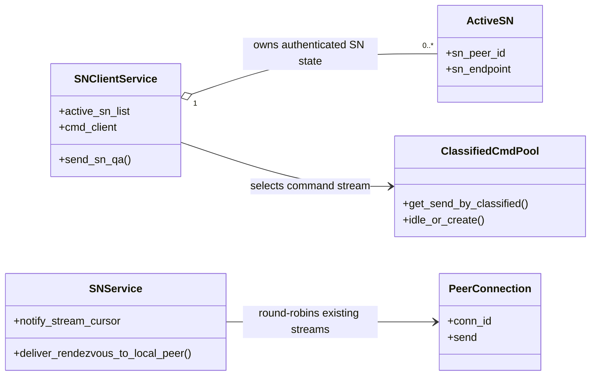
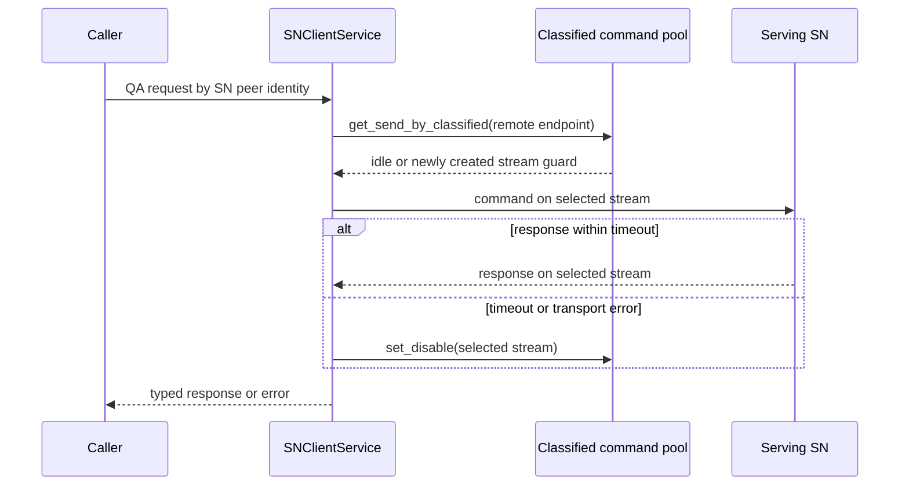
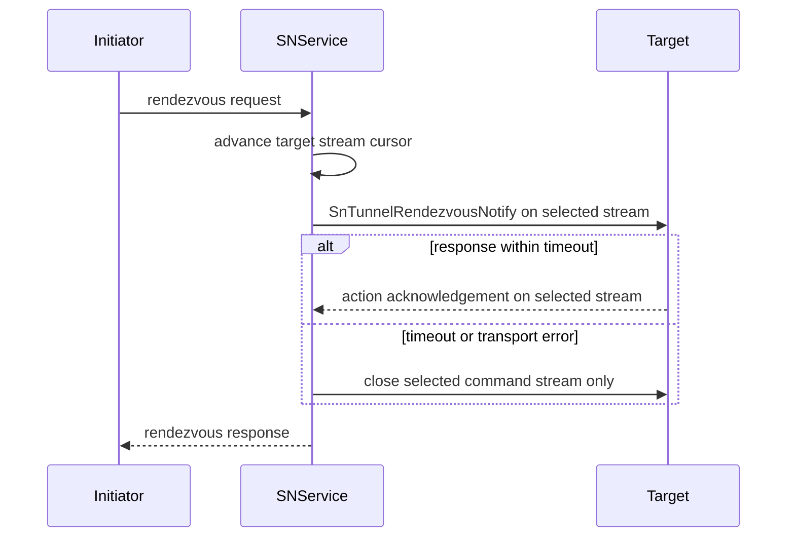
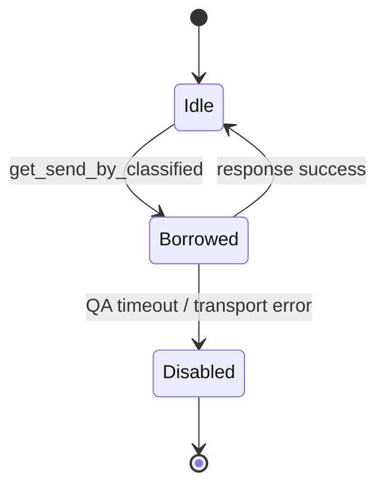

# P2P Frame Design

Risk profile: ./risk-profile.yaml

## Design Scope

### Goals

- Route every SN-client-initiated command through the existing classified command-stream pool instead of a pinned `ActiveSN.conn_id`.
- Treat command streams as per-request transport state and remove `ActiveSN.conn_id`.
- Reuse idle streams, open a new stream only below `sn_tunnel_count`, and keep multiple streams over one TTP bearer concurrently usable.
- Close only the selected command stream on QA timeout, using the existing classified guard API.
- Distribute server-initiated rendezvous QA across the target's already accepted command streams.

### Non-goals

- No SN wire format, command code, QA correlation, authentication, rendezvous action, NAT probe, PN, TTP, or `sfo-cmd-server` source change.
- No unbounded stream creation and no application-level QA pending map.

## Useful Context

- `SNClientService` owns `active_sn_list`, where `ActiveSN.conn_id` currently conflates SN identity with a command-stream guard.
- `sfo-cmd-server 0.4.0` already provides `ClassifiedCmdClient::get_send_by_classified`, classified `send_with_resp`, on-demand stream creation, and `ClassifiedCmdSend::set_disable`.
- `TtpClient::open_control_stream` reuses or creates the bearer TTP tunnel and then opens another multiplexed control stream. This capability is consumed unchanged.
- `DefaultCmdServerService` has no busy-stream scheduler for server-initiated QA; concurrent calls may repeatedly choose the same first peer connection.
- The SN client's inbound `SnCalled` response must return on the same incoming command stream because it is the correlated reply to that notification, while client-initiated QA uses a pool-selected stream.

## Overall Approach

Replace exact-`tunnel_id` QA calls with classified pool acquisition. Each QA helper obtains a classified guard, records the selected stream in request logging/cleanup context, awaits the response, and calls `set_disable()` on timeout or transport error before dropping the guard. Active-SN records are keyed by authenticated `sn_peer_id` and lose `conn_id`; profile/report updates match by peer identity. Inbound notifications match the authenticated SN peer rather than a pinned stream.

For server-initiated rendezvous QA, keep a process-local round-robin cursor over the target peer's command streams and call the existing specified-tunnel API. The command server lists a stream only while its receive task runs and removes it once that task finishes, so the candidate list is already live; select the next stream for each request and close only the selected stream after timeout or send failure. This is SN service policy; TTP and `sfo-cmd-server` remain unchanged.

Client-initiated commands must also keep the previously shipped recovery behaviour for a SN that cannot be reached at all: when no command stream to the registered SN endpoint can be reused or created, the active-SN record is evicted so the registration loop can re-resolve and re-register the serving SN. A per-request timeout, or a single failed stream on an otherwise reachable SN, must not evict a SN that still has a usable stream.

## Layered Design Document Index

| level | parent_document | unit | design_document | responsibility |
|-------|-----------------|------|-----------------|----------------|
| root | `design.md` | p2p-frame SN command transport | `design.md` | overall multi-stream ownership, dispatch, and timeout cleanup |

`not-applicable`: no new business or technical submodule is introduced; the delivery edits the existing client and server-side SN service files.

## Module Relationship UML



## File-Level Interfaces

```rust
pub struct ActiveSN {
    pub sn_peer_id: P2pId,
    pub latest_time: u64,
    pub protocol: Protocol,
    pub sn_endpoint: Endpoint,
    pub wan_ep_list: Vec<Endpoint>,
    pub nat_probe_endpoints: Vec<Endpoint>,
    pub nat_probe_signer: Option<P2pIdentityCertRef>,
    pub net_profile: NatProfile,
    pub nat_probe_registration_generation: u64,
    pub last_nat_probe_request_id: u64,
    pub next_probe_at: u64,
}
```

- Consumer: `SNClientService`, SN client tests / `CHG-remove-active-sn-conn-id`
- Compatibility: breaking
- Migration path: remove field construction and reads; use authenticated `sn_peer_id` for lifecycle and classified pool guards for transport.

```rust
impl SNClientService {
    async fn send_sn_qa(
        &self,
        classification: SnTunnelClassification,
        sn_peer_id: &P2pId,
        cmd: PackageCmdCode,
        version: u8,
        body: &[u8],
        timeout: Duration,
    ) -> P2pResult<SnQaResponse>;
    fn update_active_sn<F>(active_sn_list: &mut [ActiveSN], sn_peer_id: &P2pId, update: F) -> bool
    where
        F: FnOnce(&mut ActiveSN);
    fn remove_active_sn(&self, sn_peer_id: &P2pId);
}
```

`SnQaResponse` carries the selected command-stream identity plus the response body so callers can log and validate the exact stream that served the request.

- Consumer: report/call/query/rendezvous QA paths / `CHG-sn-client-classified-command-channel`, `CHG-qa-timeout-command-stream-close`
- Compatibility: private, new

```rust
struct SnService {
    notify_stream_cursor: AtomicUsize,
}

impl SnService {
    async fn deliver_rendezvous_to_local_peer(
        &self,
        target_peer_id: &P2pId,
        notify: &SnTunnelRendezvousNotify,
    ) -> P2pResult<SnTunnelRendezvousResp>;
}
```

- Consumer: SN rendezvous delivery / `CHG-sn-server-command-stream-selection`
- Compatibility: private, new

## API and Build Surface Impact

- Public API impact: breaking
- Crate-root export change: no
- Build-surface change: no
- Documentation examples affected: no

`ActiveSN` remains exported, but its public `conn_id` field is removed. This task does not change dependency versions, Cargo features, lockfile, packaging, or release defaults.

## Consumer Migration Closure

| Old Symbol | New Path | change_id | Consumer Path | Consumer Kind | Migration Status |
|------------|----------|-----------|---------------|---------------|------------------|
| `ActiveSN.conn_id` | per-request `ClassifiedCmdSend::get_tunnel_id()` | CHG-remove-active-sn-conn-id | `p2p-frame/src/sn/client/sn_service.rs` | production | migrated |
| `ActiveSN.conn_id` | authenticated `ActiveSN.sn_peer_id` | CHG-remove-active-sn-conn-id | `p2p-frame/tests/unit/sn_tests/client/nat_probe_directive_tests.rs` | test | migrated |
| `ActiveSN.conn_id` | authenticated `ActiveSN.sn_peer_id` | CHG-remove-active-sn-conn-id | `p2p-frame/tests/nat_type_aware/sn_profile_flow_tests.rs` | test | migrated |
| `ActiveSN.conn_id` | classified QA API | CHG-remove-active-sn-conn-id | `p2p-frame/tests/tunnel_rendezvous/sn_same_sn_tests.rs` | test | migrated |
| `ActiveSN.conn_id` | classified QA API | CHG-remove-active-sn-conn-id | `p2p-frame/tests/sn_protocol_real_network.rs` | test | migrated |
| `ActiveSN.conn_id` | classified QA API | CHG-remove-active-sn-conn-id | `p2p-frame/tests/real_p2p_tunnel_flow/collision_cross_sn.rs` | test | migrated |
| `ActiveSN.conn_id` | authenticated `ActiveSN.sn_peer_id` | CHG-remove-active-sn-conn-id | `p2p-frame/tests/nat_type_aware/tunnel_manager_tests.rs` | test | migrated |
| `ActiveSN.conn_id` | on-demand command-stream re-creation through the classified pool, with unreachable-SN eviction retained for re-registration | CHG-remove-active-sn-conn-id | `p2p-frame/src/sn/tests.rs` | test | migrated |

## Key Flows







## State and Ownership

- Owner: `SNClientService` is the sole owner of authenticated active-SN lifecycle state; the classified command pool is the sole owner of command-stream guards, and `SNService` is the sole owner of server-side notify selection state.
- `SNClientService.state` owns authenticated active-SN records. `ActiveSN` is keyed by `sn_peer_id` and owns profile/report metadata only.
- The classified command client owns command-stream guards and whether a stream is idle, borrowed, or disabled. `ActiveSN` does not own transport handles.
- A selected `ClassifiedCmdSend` guard is owned by one QA request until the request completes or cleans up.
- `SNService.notify_stream_cursor` owns server-side round-robin selection. It never creates target streams.
- `SNClientService` owns active-SN eviction: a command-stream acquisition failure for a registered SN removes that peer's record so the registration loop can re-register it. No other automatic path removes active-SN records.
- Inbound `SnCalled` correlation is owned by the request that received the notification; its response uses the same incoming `conn_id`.

### Invariants to Preserve

- A QA response is accepted only on the stream selected for that request, with matching command, sequence, and authenticated SN peer.
- A stream timeout disables that stream but not the bearer TTP tunnel or other streams.
- Active-SN profile updates cannot be written by a stale stream identity after a newer authenticated registration.
- A stream failure cannot remove an active SN that still has a healthy command stream; a SN for which no command stream can be obtained is evicted so the client re-registers instead of reporting online against an unreachable endpoint.

## Directly Mapped Change Items

| change_id | target_module | proposal_id | Design Coverage | Scope Paths |
|-----------|---------------|-------------|-----------------|-------------|
| CHG-sn-client-classified-command-channel | p2p-frame | P-001 | Overall Approach; File-Level Interfaces; Key Flows | `p2p-frame/src/sn/client/sn_service.rs`, `p2p-frame/src/sn/types.rs`, `p2p-frame/src/sn/tests.rs`, `p2p-frame/tests` |
| CHG-sn-command-active-identity-lifecycle | p2p-frame | P-002 | Overall Approach; State and Ownership; Invariants to Preserve | `p2p-frame/src/sn/client/sn_service.rs`, `p2p-frame/src/sn/types.rs`, `p2p-frame/src/sn/service/service.rs`, `p2p-frame/src/sn/tests.rs`, `p2p-frame/tests` |
| CHG-sn-server-command-stream-selection | p2p-frame | P-003 | Overall Approach; File-Level Interfaces; second Key Flow | `p2p-frame/src/sn/service/service.rs`, `p2p-frame/tests` |
| CHG-qa-timeout-command-stream-close | p2p-frame | P-004 | Overall Approach; timeout Key Flow; command-stream state diagram | `p2p-frame/src/sn/client/sn_service.rs`, `p2p-frame/src/sn/service/service.rs`, `p2p-frame/tests` |
| CHG-remove-active-sn-conn-id | p2p-frame | P-005 | File-Level Interfaces; Consumer Migration Closure; State and Ownership | `p2p-frame/src/sn/client/sn_service.rs`, `p2p-frame/src/sn/tests.rs`, `p2p-frame/tests` |

## Implementation Order

| Phase | Goal | Depends On | Output |
|-------|------|------------|--------|
| 1 | Introduce classified QA helper and peer-keyed active-SN updates | none | client transport no longer depends on `ActiveSN.conn_id` |
| 2 | Remove `ActiveSN.conn_id` and migrate internal callers | 1 | public active-SN shape reduced to identity/profile state |
| 3 | Add server-side round-robin notify selection and timeout cleanup | 2 | server QA distributes across existing streams |
| 4 | Migrate repository consumers and compile | 1-3 | complete source closure |

## File-Level Implementation Sequence

| sequence | file_level_module | action | depends_on | change_id | scope_path | implementation_task |
|----------|-------------------|--------|------------|-----------|------------|---------------------|
| 1 | `p2p-frame/src/sn/client/sn_service.rs` | modify | none | CHG-sn-client-classified-command-channel, CHG-sn-command-active-identity-lifecycle, CHG-qa-timeout-command-stream-close, CHG-remove-active-sn-conn-id | `p2p-frame/src/sn/client/sn_service.rs` | I-001 |
| 2 | `p2p-frame/src/sn/service/service.rs` | modify | 1 | CHG-sn-server-command-stream-selection, CHG-sn-command-active-identity-lifecycle, CHG-qa-timeout-command-stream-close | `p2p-frame/src/sn/service/service.rs` | I-002 |
| 3 | `p2p-frame/tests/unit/sn_tests/client/nat_probe_directive_tests.rs` | modify | 1-2 | CHG-remove-active-sn-conn-id, CHG-sn-command-active-identity-lifecycle | `p2p-frame/tests` | I-003 |
| 4 | `p2p-frame/tests/nat_type_aware/sn_profile_flow_tests.rs` | modify | 1-2 | CHG-remove-active-sn-conn-id | `p2p-frame/tests` | I-004 |
| 5 | `p2p-frame/tests/nat_type_aware/tunnel_manager_tests.rs` | modify | 1-2 | CHG-remove-active-sn-conn-id | `p2p-frame/tests` | I-005 |
| 6 | `p2p-frame/tests/tunnel_rendezvous/sn_same_sn_tests.rs` | modify | 1-2 | CHG-remove-active-sn-conn-id | `p2p-frame/tests` | I-006 |
| 7 | `p2p-frame/tests/sn_protocol_real_network.rs` | modify | 1-2 | CHG-remove-active-sn-conn-id | `p2p-frame/tests` | I-007 |
| 8 | `p2p-frame/tests/real_p2p_tunnel_flow/collision_cross_sn.rs` | modify | 1-2 | CHG-remove-active-sn-conn-id | `p2p-frame/tests` | I-008 |
| 9 | `p2p-frame/src/sn/tests.rs` | modify | 1-2 | CHG-sn-client-classified-command-channel, CHG-remove-active-sn-conn-id | `p2p-frame/src/sn/tests.rs` | I-009 |

## Design Notes

- Per-command stream creation is rejected because it is unbounded. The existing classified pool provides bounded reuse and on-demand creation.
- The inbound `SnCalledResp` exception is deliberate: it is the correlated response to a received notification, not an independently scheduled client command.
- A round-robin cursor is the smallest server-side distribution policy compatible with the existing command-server API and does not require dependency changes.
- Active-SN eviction is bound to command-stream acquisition failure only. The classified pool waits instead of failing when the configured stream cap is reached, so capacity pressure cannot be mistaken for an unreachable SN.

## Risks and Rollback

- Risk: concurrent classified streams can expose stale peer/profile updates. Mitigate by peer-keyed updates and preserving response validation.
- Risk: timeout cleanup can close the bearer by mistake. Keep cleanup on the selected command-stream guard only.
- Risk: server cursor can repeatedly select a dead stream. The command server lists a stream only while its receive task runs, and selection advances past a stream whose send or response fails.
- Risk: eviction could drop a reachable SN while the stream pool is exhausted. Mitigate by evicting only when command-stream acquisition itself fails; the pool waits at the configured cap instead of returning an error.
- Rollback: revert the SN client and service changes; no protocol, TTP, or dependency migration is needed.

## Approval Record

- approver: user
- approval_date: 2026-09-13
- user_statement: 确认该设计与 high-risk 分级，按 high-risk 流程自动执行到验证与收尾
