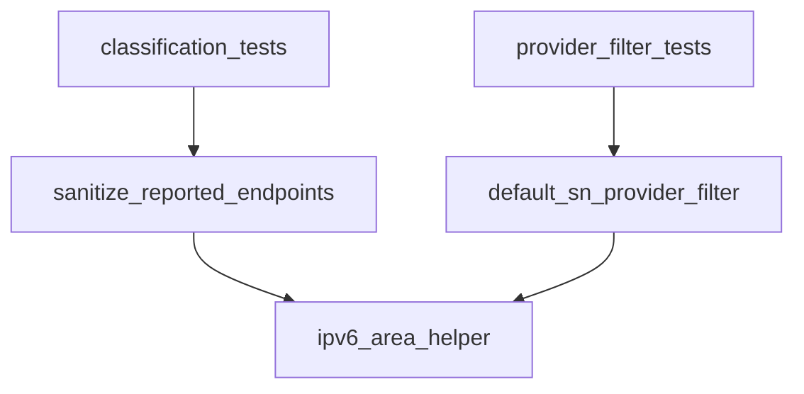

# Pipeline Plan

Workflow tier: high-risk

Risk profile: ./risk-profile.yaml

## Trigger
- Proposal: docs/versions/v0.1/modules/p2p-frame/079-classify-ipv6-reported-endpoints/proposal.md
- User launch confirmed: yes
- User launch statement: `确认，1不排除，2只在DefaultSnLocalIpProvider中添加，自动完成`
- Launch stage: proposal
- First auto stage: design
- Design source: pipeline/plan.md
- Per-stage user confirmation: skipped by explicit user auto-pipeline authorization
- Auto-confirm completed document stages: no design/testing Markdown documents generated; automatic design uses this pipeline plan and automatic testing uses runtime state plus testplan.yaml
- Auto-pipeline document policy: stage-selective; no design/testing Markdown docs generated; automatic design uses pipeline plan; automatic testing uses runtime state; testplan.yaml required for automatic testing
- Version: v0.1
- Packet module: p2p-frame
- Task name: 079-classify-ipv6-reported-endpoints
- Target module(s): p2p-frame
- change_id values: CHG-ipv6-sanitizer-area, CHG-client-ip-report-filter

## Acceptance Baseline
- `sanitize_reported_endpoints` classifies non-special global IPv6 as `Wan` without the IPv4 exact-observed condition; ULA/link-local/IPv4-mapped/documentation/benchmarking as `Lan`; loopback/unspecified/multicast omitted.
- IPv4 exact-observed public endpoint trust boundary is unchanged.
- `DefaultSnLocalIpProvider` (only) omits loopback/unspecified/multicast for both address families; IPv4-mapped/documentation/benchmarking remain.
- IPv6 Wan endpoints remain eligible to flow into legacy SnCall reverse endpoint arrays (user-confirmed: no exclusion).

## Stage Graph
| Task ID | Stage | Execution Mode | Responsibility | Scope | Parent Task | Depends On | Output | Done Condition |
|---------|-------|----------------|----------------|-------|-------------|------------|--------|----------------|
| D-1 | design | auto-pipeline | bind IPv6 classification policy and client filter boundary | task packet and current endpoint/sanitizer call chain | root | none | validated pipeline-plan mappings | plan and risk profile pass design checks |
| I-1 | implementation | auto-pipeline | deliver production IPv6 area classification and DefaultSnLocalIpProvider filter | p2p-frame endpoint, SN service, and client sources | root | D-1 | production source changes | implementation and admission checks complete |
| T-1 | testing | auto-pipeline | design and run IPv6 classification and client filter regression coverage | task-owned p2p-frame tests | root | I-1 | testplan, tests, and run evidence | task-scoped coverage and run pass |
| A-1 | acceptance | auto-pipeline | independently falsify classification, compatibility, and evidence | complete task delivery | root | T-1 | acceptance report | accepted report passes with no blocking finding |

## Submodule Tasks
| Task ID | Stage | Execution Mode | Responsibility | Submodule | Parent Task | Depends On | Output | Done Condition |
|---------|-------|----------------|----------------|-----------|-------------|------------|--------|----------------|
| I-ENDPOINT | implementation | auto-pipeline | add stable IPv6 area classification helper and unit tests | p2p-frame endpoint classification | I-1 | D-1 | `p2p-frame/src/endpoint.rs` | IPv6 area table is complete and unit-covered |
| I-SERVICE | implementation | auto-pipeline | wire IPv6 Wan/Lan branches into report sanitizer | SN report sanitization | I-1 | I-ENDPOINT | `p2p-frame/src/sn/service/service.rs` | IPv4 rule unchanged and IPv6 branches reachable in tests |
| I-CLIENT | implementation | auto-pipeline | omit loopback/unspecified/multicast in DefaultSnLocalIpProvider only | client local-IP collection | I-1 | I-ENDPOINT | `p2p-frame/src/sn/client/sn_service.rs` | filter unit coverage passes |
| T-REGRESSION | testing | auto-pipeline | execute sanitizer/classification and provider filter regressions | p2p-frame task tests | T-1 | I-SERVICE, I-CLIENT | testplan, tests, and run evidence | task test run passes |

## Merged-Task Reasons
- Production edits are split by file-level responsibility (endpoint helper, service sanitizer, client provider) so each submodule has one owner and one output.
- Testing stays one task because sanitizer classification and provider filtering jointly verify one behavior boundary and share one task testplan.
- Design, implementation, testing, and acceptance remain separate dependency-linked tasks; the parent orchestrator owns the shared plan, state, testplan, and acceptance integration.

## Parallel Scheduling
- Strategy: dependency-ready-set
- Concurrency: use all runtime-available child-agent slots; this run uses one authorized primary execution slot
- Shared artifact owner: parent-orchestrator
- Lock directory: `.harness/locks/`
- Dispatch rule: launch dependency-ready work with practical edit coordination and available capacity
- Serialization reasons: explicit dependency, edit coordination, or exhausted concurrency capacity
- Evidence: scheduler waves are recorded in `.harness/pipelines/v0.1/p2p-frame/079-classify-ipv6-reported-endpoints/state.json`

## Dependency Graphs

| Level | Parent | Node | Depends On |
|-------|--------|------|------------|
| file | p2p-frame | ipv6_area_helper | none |
| file | p2p-frame | sanitize_reported_endpoints | ipv6_area_helper |
| file | p2p-frame | default_sn_provider_filter | ipv6_area_helper |
| file | p2p-frame | classification_tests | sanitize_reported_endpoints |
| file | p2p-frame | provider_filter_tests | default_sn_provider_filter |

## Exported Interfaces
| Interface | Owner | Consumer | Compatibility | Affected Callers | Migration Path |
|-----------|-------|----------|---------------|------------------|----------------|
| private IPv6 area classification helper (endpoint.rs, pub(crate)) | p2p-frame endpoint | `SnService::sanitize_reported_endpoints` and tests | new | crate-internal consumers introduced by this task | keep helper stable-predicate only; no public export |
| private `SnService::sanitize_reported_endpoints` | p2p-frame SN service | report handler and unit tests | backward-compatible | `handle_report_sn`, existing sanitizer tests | IPv4 branch unchanged; IPv6 branches extend retained set |
| private `DefaultSnLocalIpProvider::filter_local_ips` | p2p-frame SN client | `get_local_ips` and unit tests | backward-compatible | local IP collection path | add unspecified/multicast omission |

## API and Build Surface Impact
- Public API impact: none
- Crate-root export change: no
- Build-surface change: no
- Documentation examples affected: no

## Consumer Migration Closure
| Old Symbol | New Path | change_id | Consumer Path | Consumer Kind | Migration Status |
|------------|----------|-----------|---------------|----------------|------------------|
| not-applicable | IPv6 area helper | CHG-ipv6-sanitizer-area | p2p-frame/src/sn/service/service.rs | crate-internal consumer | migrated |
| not-applicable | `filter_local_ips` filter conditions | CHG-client-ip-report-filter | p2p-frame/src/sn/client/sn_service.rs `get_local_ips` | crate-internal consumer | migrated |

## State Ownership
| State | Owner | Access Interface | Lifecycle | Failure Transitions |
|-------|-------|------------------|-----------|---------------------|
| reported endpoint cache snapshot | SN peer manager | sanitizer output -> `add_or_update_peer` local_eps | report -> sanitize -> cache replace | invalid/unsupported members omitted; IPv4 exact-observed rule and LAN hints preserved |

## Failure Flows
| Flow | Boundary | Failure | Handling |
|------|----------|---------|----------|
| ReportSn local_eps -> sanitizer | authenticated report -> server-classified cache members | IPv6 loopback/unspecified/multicast reported | omitted; IPv6 global -> Wan; Lan classes unchanged |
| Client local IP collection | if_addrs result -> DefaultSnLocalIpProvider | loopback/unspecified/multicast present | omitted before provider returns; report_on_send untouched |
| Legacy SnCall reverse arrays | sanitized local_eps -> reverse_eps | IPv6 Wan included | user-confirmed: keep current consumption; no new exclusion |

## Rejected Alternatives
| Decision Type | Selected | Rejected | Reason |
|---------------|----------|----------|--------|
| boundary | IPv6 Wan without observed-IP condition, IPv4 exact-observed unchanged | treat IPv6 with the same observed requirement as IPv4 | report tunnel is IPv4 so no IPv6 is observable; user confirmed the asymmetry |
| boundary | legacy SnCall reverse arrays keep IPv6 Wan | exclude IPv6 Wan there | user explicitly chose 1不排除 |
| technical | stable methods plus manual prefix/segment checks | nightly `is_global`/`is_unicast_global`/`is_ipv4_mapped` | APIs are nightly-only through Rust 1.98 |
| technical | client filter only in `DefaultSnLocalIpProvider` | add another report-assembly filter | user explicitly chose 2只在DefaultSnLocalIpProvider中添加 |
| collaboration | single dependent file-level tasks in one auto-pipeline run | parallel edits to overlapping sanitizer/helper files | overlapping write scope; each stage remains dependency-linked with one owner |

## Implementation Scope Bindings
| change_id | target_module | proposal_id | design_coverage | scope_paths | design_rules_applied |
|-----------|---------------|-------------|-----------------|-------------|----------------------|
| CHG-ipv6-sanitizer-area | p2p-frame | P-001 | IPv6 area classification: Wan for non-special IPv6, Lan for ULA/link-local/IPv4-mapped/doc/benchmark, omit loopback/unspecified/multicast; IPv4 exact-observed unchanged | `p2p-frame/src/endpoint.rs`, `p2p-frame/src/sn/service/service.rs` | stability, trust-boundary preservation, focused sanitizer helper |
| CHG-client-ip-report-filter | p2p-frame | P-002 | `DefaultSnLocalIpProvider` only omits loopback/unspecified/multicast for IPv4/IPv6; report_on_send untouched | `p2p-frame/src/sn/client/sn_service.rs` | single-owner collection boundary, minimal delta |

## File-Level Implementation Sequence
| Sequence | Task ID | File-Level Module | Action | Depends On | change_id | target_module | Scope Paths | Context Sources |
|----------|---------|-------------------|--------|------------|-----------|---------------|-------------|-----------------|
| 1 | I-ENDPOINT | `p2p-frame/src/endpoint.rs` | modify | none | CHG-ipv6-sanitizer-area | p2p-frame | `p2p-frame/src/endpoint.rs` | proposal P-001, current `is_non_lan_ipv4_addr`, std stability check |
| 2 | I-SERVICE | `p2p-frame/src/sn/service/service.rs` | modify | I-ENDPOINT | CHG-ipv6-sanitizer-area | p2p-frame | `p2p-frame/src/sn/service/service.rs` | sanitize_reported_endpoints, 053 boundary |
| 3 | I-CLIENT | `p2p-frame/src/sn/client/sn_service.rs` | modify | I-ENDPOINT | CHG-client-ip-report-filter | p2p-frame | `p2p-frame/src/sn/client/sn_service.rs` | DefaultSnLocalIpProvider::filter_local_ips |

## Return Rules
- If acceptance finds proposal ambiguity, stop and ask the user; do not infer a new requirement.
- If acceptance finds an implementation defect, return the affected behavior to implementation and regenerate testing evidence.
- If missing or inadequate test coverage is found, return to testing implementation.
- If the same unresolved issue remains after more than 5 unsuccessful iterations, stop and report it.
