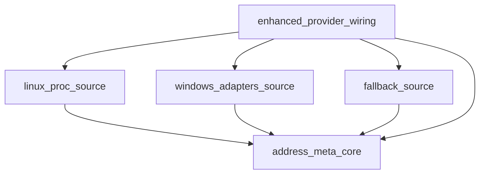

# Pipeline Plan

Workflow tier: high-risk

Risk profile: ./risk-profile.yaml

## Trigger
- Proposal: docs/versions/v0.1/modules/p2p-frame/080-platform-ipv6-local-address-selection/proposal.md
- User launch confirmed: yes
- User launch statement: `确认，自动完成`
- Launch stage: proposal
- First auto stage: design
- Design source: pipeline/plan.md
- Per-stage user confirmation: skipped by explicit user auto-pipeline authorization
- Auto-confirm completed document stages: no design/testing Markdown documents generated; automatic design uses this pipeline plan and automatic testing uses runtime state plus testplan.yaml
- Auto-pipeline document policy: stage-selective; no design/testing Markdown docs generated; automatic design uses pipeline plan; automatic testing uses runtime state; testplan.yaml required for automatic testing
- Version: v0.1
- Packet module: p2p-frame
- Task name: 080-platform-ipv6-local-address-selection
- Target module(s): p2p-frame
- change_id values: CHG-local-ip-metadata-pipeline, CHG-linux-if-inet6-source, CHG-windows-adapters-source, CHG-fallback-platform-parity, CHG-enhanced-provider-wiring

## Acceptance Baseline
- Client local address selection keeps `SnLocalIpProvider`, `DefaultSnLocalIpProvider` name filtering, and the `report_on_send` 32-endpoint cap boundaries unchanged, and only narrows which addresses are reported.
- Deprecated, tentative, DAD-failed and duplicate addresses never enter the reported local address set on Linux and Windows; preferred/stable addresses rank before temporary or random ones.
- `fe80::/10` link-local and `fc00::/7` ULA addresses keep their current reporting behavior, and addresses without platform metadata (macOS and other platforms) keep base-ordered behavior.
- Linux reads `/proc/net/if_inet6` with the real kernel flag bits (0x20 deprecated, 0x40 tentative, 0x08 DAD-failed, 0x01 temporary, 0x80 permanent) and parses flags as an unsigned 32-bit value.
- Windows collects adapter state through the existing `winapi` dependency (`GetAdaptersAddresses`) with no new crate, verified by cross-target compilation.
- No program path executes `ip -6 addr del` or any other kernel address-table mutation.

## Stage Graph
| Task ID | Stage | Execution Mode | Responsibility | Scope | Parent Task | Depends On | Output | Done Condition |
|---------|-------|----------------|----------------|-------|-------------|------------|--------|----------------|
| D-1 | design | auto-pipeline | bind address-source, selection policy and provider wiring boundary | task packet, client collection call chain, pipeline plan | root | none | validated pipeline-plan mappings | plan, risk profile and design checks pass |
| I-1 | implementation | auto-pipeline | deliver platform address sources and selection pipeline | p2p-frame client sources and winapi features | root | D-1 | production source changes | admission, schema, stage-scope and pipeline checks pass |
| T-1 | testing | auto-pipeline | design and run address-selection coverage | task-owned p2p-frame tests | root | I-1 | testplan, tests and run evidence | task test run and coverage checks pass |
| A-1 | acceptance | auto-pipeline | independently falsify filtering, ranking and platform boundaries | complete task delivery | root | T-1 | acceptance report | accepted report passes without blocking finding |

## Submodule Tasks
| Task ID | Stage | Execution Mode | Responsibility | Submodule | Parent Task | Depends On | Output | Done Condition |
|---------|-------|----------------|----------------|-----------|-------------|------------|--------|----------------|
| I-CORE | implementation | auto-pipeline | platform-neutral AddressMeta plus deterministic filter and rank | client address selection core | I-1 | D-1 | `p2p-frame/src/sn/client/local_ip.rs` | core pure functions compile and are covered |
| I-LINUX | implementation | auto-pipeline | /proc/net/if_inet6 source with kernel flag decoding | linux address metadata source | I-1 | I-CORE | `p2p-frame/src/sn/client/local_ip.rs` | linux metadata mapping matches kernel flags |
| I-WINDOWS | implementation | auto-pipeline | GetAdaptersAddresses source over the existing winapi dependency | windows address metadata source | I-1 | I-CORE | `p2p-frame/src/sn/client/local_ip.rs`, `p2p-frame/Cargo.toml` | windows target cross-check compiles |
| I-FALLBACK | implementation | auto-pipeline | keep base semantics for platforms without metadata API | platform fallback source | I-1 | I-CORE | `p2p-frame/src/sn/client/local_ip.rs` | fallback path keeps base-ordered output |
| I-WIRING | implementation | auto-pipeline | enhanced provider construction and module registration | client provider wiring | I-1 | I-LINUX, I-WINDOWS, I-FALLBACK | `p2p-frame/src/sn/client/sn_service.rs`, `p2p-frame/src/sn/client/mod.rs` | default construction uses the enhanced provider and trait injection still works |
| T-UNIT | testing | auto-pipeline | extend inline selection coverage for kernel samples, metadata table and subset invariant | client address selection tests | T-1 | I-1 | inline unit coverage in client sources | task unit test run passes with the new cases |
| T-REGRESSION | testing | auto-pipeline | run regression closure for provider filters, lib suite and windows cross-check | p2p-frame task tests | T-1 | T-UNIT | testplan steps and run evidence | regression steps pass under the task runner |

## Merged-Task Reasons
- Production edits concentrate in one new module plus one wiring file, so implementation is split by file-level responsibility (core selection, linux source, windows source, fallback source, wiring) with each submodule owning one output.
- Testing stays split into one inline-coverage task and one regression-closure task because inline coverage must be verified against a captured implementation baseline while regression closure reuses existing provider tests and cross-target compilation.
- Design, implementation, testing and acceptance remain separate dependency-linked tasks; the parent orchestrator owns the shared plan, runtime state, testplan and acceptance integration.
- `I-LINUX`, `I-WINDOWS` and `I-FALLBACK` share `p2p-frame/src/sn/client/local_ip.rs`; they are serialized by write scope instead of being merged because each one carries a distinct `change_id` and acceptance must be able to attribute a defect to one platform source.
- Proposal P-001 named `sn_service.rs` as the home of the new module; design places the crate-internal module in the new file `p2p-frame/src/sn/client/local_ip.rs` so that each platform source owns a file-level scope while `sn_service.rs` keeps only the provider wiring. This is a file-layout refinement inside the approved boundary (trait signature, subset invariant and report assembly stay unchanged) and does not change the requirement baseline.

## Parallel Scheduling
- Strategy: dependency-ready-set
- Concurrency: use all runtime-available child-agent slots; this run uses one authorized primary execution slot
- Shared artifact owner: parent-orchestrator
- Lock directory: `.harness/locks/`
- Dispatch rule: launch dependency-ready work with practical edit coordination and available capacity
- Serialization reasons: explicit dependency, edit coordination, or exhausted concurrency capacity
- Evidence: scheduler waves are recorded in `.harness/pipelines/v0.1/p2p-frame/080-platform-ipv6-local-address-selection/state.json`

## Dependency Graphs

| Level | Parent | Node | Depends On |
|-------|--------|------|------------|
| file | p2p-frame | address_meta_core | none |
| file | p2p-frame | linux_proc_source | address_meta_core |
| file | p2p-frame | windows_adapters_source | address_meta_core |
| file | p2p-frame | fallback_source | address_meta_core |
| file | p2p-frame | enhanced_provider_wiring | address_meta_core, linux_proc_source, windows_adapters_source, fallback_source |

## Exported Interfaces
| Interface | Owner | Consumer | Compatibility | Affected Callers | Migration Path |
|-----------|-------|----------|---------------|------------------|----------------|
| public `SnLocalIpProvider` trait and `SnLocalIpProviderRef` (`sn_service.rs:456-460`) | p2p-frame SN client | SNClientService report path, `stack.rs` injection, cyfs-p2p-test fake provider | backward-compatible | p2p-frame/src/stack.rs:582, p2p-frame/src/sn/client/sn_service.rs report_and_send paths, cyfs-p2p-test/src/main.rs:812 | trait signature and injection seam unchanged; enhanced provider implements the existing trait |
| private `DefaultSnLocalIpProvider::filter_local_ips` (`sn_service.rs:506`) | p2p-frame SN client | `get_local_ips` and the 078 filter/cap unit tests | backward-compatible | p2p-frame/src/sn/client/sn_service.rs:2518-2577 | keep filtering semantics; add a name-preserving sibling used only by the enhanced provider |
| new crate-internal `local_ip` module (`sn::client::local_ip`) | p2p-frame SN client | enhanced provider wiring and inline unit coverage | new | crate-internal consumers introduced by this task | keep crate-internal; no crate-root export and no public re-export |
| `winapi` dependency feature set | p2p-frame build manifest | Windows target build of p2p-frame | backward-compatible | p2p-frame/Cargo.toml | add `iptypes` and `iphlpapi` features consumed only by `cfg(target_os = "windows")` code |

## API and Build Surface Impact
- Public API impact: none
- Crate-root export change: no
- Build-surface change: yes
- Documentation examples affected: no

## Consumer Migration Closure
| Old Symbol | New Path | change_id | Consumer Path | Consumer Kind | Migration Status |
|------------|----------|-----------|---------------|----------------|------------------|
| not-applicable | crate-internal `local_ip` module registration | CHG-local-ip-metadata-pipeline | p2p-frame/src/sn/client/mod.rs | crate-internal module registration | migrated |
| not-applicable | Linux `/proc/net/if_inet6` metadata source | CHG-linux-if-inet6-source | p2p-frame/src/sn/client/local_ip.rs | crate-internal consumer | migrated |
| winapi feature set (winsock2, mswsock, ws2def, ws2ipdef) | winapi features plus iptypes and iphlpapi | CHG-windows-adapters-source | p2p-frame/Cargo.toml | build manifest | migrated |
| not-applicable | platform fallback source | CHG-fallback-platform-parity | p2p-frame/src/sn/client/local_ip.rs | crate-internal consumer | migrated |
| `DefaultSnLocalIpProvider` default construction | `EnhancedLocalIpProvider` default construction | CHG-enhanced-provider-wiring | p2p-frame/src/sn/client/sn_service.rs | crate-internal consumer | migrated |

## State Ownership
| State | Owner | Access Interface | Lifecycle | Failure Transitions |
|-------|-------|------------------|-----------|---------------------|
| local address selection result | SN client local ip provider | `get_local_ips` -> `report_on_send` local_eps | computed per SN report cycle | platform metadata errors fall back to base address list; nothing is cached |
| kernel and adapter metadata snapshot | platform source function | `platform_annotate(interface addresses)` | created per `get_local_ips` call | unreadable `/proc/net/if_inet6` or failed adapter query yields unknown metadata and the address is retained |

## Failure Flows
| Flow | Boundary | Failure | Handling |
|-------|----------|---------|----------|
| interface enumeration -> base filter | `if_addrs` -> `filter_local_ips_with_names` | interface enumeration returns an error | provider returns an empty list, matching current base behavior |
| `/proc` parse -> metadata | `/proc/net/if_inet6` -> `AddressMeta` | file missing, malformed line, or flags wider than one byte | skip that line only; the address stays in the result with unknown metadata and parsing never panics |
| adapter query -> metadata | `GetAdaptersAddresses` -> `AddressMeta` | buffer sizing loop error or null adapter list | return empty metadata so the base address list is retained unchanged |
| selection -> report | selected addresses -> `report_on_send` local_eps | every global address on an interface is filtered | remaining addresses such as link-local stay reported; the 32 endpoint cap and assembly order stay unchanged |

## Rejected Alternatives
| Decision Type | Selected | Rejected | Reason |
|---------------|----------|----------|--------|
| boundary | keep `DefaultSnLocalIpProvider` as the only client-side filter and wrap it with an enhanced provider | add a second independent provider implementation without the base name filter | 078/079 approved the default provider surface and the trait as the injection seam; wrapping preserves the subset invariant |
| technical | decode the real kernel `IFA_F_*` bits (0x20 deprecated, 0x40 tentative, 0x08 DAD-failed) and parse flags as u32 | the draft plan's 0x04 deprecated / 0x08 tentative / 0x40 anycast / 0x80 global mapping | the draft mapping contradicts linux/if_addr.h:45-58 and would retain the two deprecated addresses observed on company-wgr |
| technical | reuse the existing `winapi` dependency with `iptypes`/`iphlpapi` features | add the `windows` crate | avoids dependency-set and lockfile change; winapi 0.3.9 already exposes `GetAdaptersAddresses` and `IP_ADAPTER_UNICAST_ADDRESS_LH` DAD/suffix fields |
| collaboration | serial dependency-linked child tasks in one auto-pipeline run | parallel edits to the same new module file | the linux, windows and fallback sources share `p2p-frame/src/sn/client/local_ip.rs`, so their write scopes overlap |

## Implementation Scope Bindings
| change_id | target_module | proposal_id | design_coverage | scope_paths | design_rules_applied |
|-----------|---------------|-------------|-----------------|-------------|----------------------|
| CHG-local-ip-metadata-pipeline | p2p-frame | P-001 | platform-neutral AddressMeta plus deterministic filter/rank with subset invariant and stable tie-breaking | `p2p-frame/src/sn/client/local_ip.rs` | single-owner selection boundary, deterministic ordering, subset invariant |
| CHG-linux-if-inet6-source | p2p-frame | P-002 | Linux `/proc/net/if_inet6` parsing with real kernel flag bits, u32 flags and safe fallback on malformed input | `p2p-frame/src/sn/client/local_ip.rs` | platform source isolation, defensive parsing without panics |
| CHG-windows-adapters-source | p2p-frame | P-003 | Windows adapter metadata via `GetAdaptersAddresses` on the existing winapi dependency, DAD state and suffix origin mapping | `p2p-frame/src/sn/client/local_ip.rs`, `p2p-frame/Cargo.toml` | minimal dependency delta, cfg-gated FFI isolation |
| CHG-fallback-platform-parity | p2p-frame | P-004 | non-Linux/Windows platforms keep base-ordered output with unknown metadata | `p2p-frame/src/sn/client/local_ip.rs` | explicit fallback semantics, documented platform gap |
| CHG-enhanced-provider-wiring | p2p-frame | P-005 | default construction uses the enhanced provider while the trait, module registration and injection seam stay unchanged | `p2p-frame/src/sn/client/sn_service.rs`, `p2p-frame/src/sn/client/mod.rs` | provider seam preservation, no public API delta |

## File-Level Implementation Sequence
| Sequence | Task ID | File-Level Module | Action | Depends On | change_id | target_module | Scope Paths | Context Sources |
|----------|---------|-------------------|--------|------------|-----------|---------------|-------------|-----------------|
| 1 | I-CORE | `p2p-frame/src/sn/client/local_ip.rs` | create | none | CHG-local-ip-metadata-pipeline | p2p-frame | `p2p-frame/src/sn/client/local_ip.rs` | proposal P-001, sn_service.rs:456-527 provider seam |
| 2 | I-LINUX | `p2p-frame/src/sn/client/local_ip.rs` | modify | I-CORE | CHG-linux-if-inet6-source | p2p-frame | `p2p-frame/src/sn/client/local_ip.rs` | /usr/include/linux/if_addr.h:45-58, live /proc/net/if_inet6 host sample |
| 3 | I-WINDOWS | `p2p-frame/src/sn/client/local_ip.rs`, `p2p-frame/Cargo.toml` | modify | I-CORE | CHG-windows-adapters-source | p2p-frame | `p2p-frame/src/sn/client/local_ip.rs`, `p2p-frame/Cargo.toml` | winapi-0.3.9 iptypes.rs:77-88, iphlpapi.rs:337 |
| 4 | I-FALLBACK | `p2p-frame/src/sn/client/local_ip.rs` | modify | I-CORE | CHG-fallback-platform-parity | p2p-frame | `p2p-frame/src/sn/client/local_ip.rs` | proposal P-004 platform gap statement |
| 5 | I-WIRING | `p2p-frame/src/sn/client/sn_service.rs`, `p2p-frame/src/sn/client/mod.rs` | modify | I-LINUX, I-WINDOWS, I-FALLBACK | CHG-enhanced-provider-wiring | p2p-frame | `p2p-frame/src/sn/client/sn_service.rs`, `p2p-frame/src/sn/client/mod.rs` | sn_service.rs:582 default construction, stack.rs:582 injection path |

## Return Rules
- If acceptance finds proposal ambiguity, stop and ask the user; do not infer a new requirement.
- If acceptance finds a design or interface defect, return the affected mapping to design and refresh this plan before implementation changes.
- If acceptance finds an implementation defect, return the affected behavior to implementation and regenerate testing evidence.
- If missing or inadequate test coverage is found, return to testing implementation.
- If the same unresolved issue remains after more than 5 unsuccessful iterations, stop and report it.
