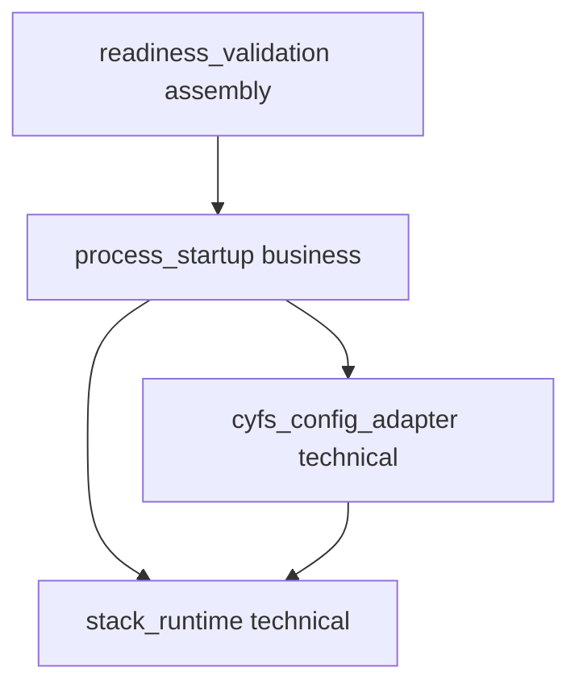

# Server Runtime Ownership Fix Design

## Design Scope
### Goals
- Make the versioned SN runtime contract match the delivered compile-time-required constructor.
- Move CYFS P2P runtime creation to application callers and share one runtime in combined startup.
- Define a deterministic, externally auditable owner/serving readiness contract.
- Make the feature-gated runtime regression test reachable through the unified test entry.

### Non-goals
- No change to `ServerRuntime` internals, worker scheduling, TCP/QUIC/SN wire behavior, TLS, endpoint classification, or owner-directory commands.
- No singleton, lazy global runtime, optional runtime field, hidden default helper, health-check network protocol, or public readiness RPC.
- No rewrite of the approved parent packet; this sibling design supersedes only its stale runtime error/evidence wording for the five mapped change ids.

## Overall Approach
`p2p-frame` keeps its current required `ServerRuntime` fields in `SnServiceConfig` and `P2pConfig`. `create_sn_service(...)` remains a `P2pResult`-returning async API for compatibility with the existing construction call chain, but missing runtime is not one of its runtime errors because the constructor makes that state unrepresentable.

`cyfs-p2p::create_cyfs_p2p_config` changes to `create_cyfs_p2p_config(endpoints, server_runtime)`. It constructs identity factories and passes the supplied handle to `P2pConfig::new`; it contains no `ServerRuntime::start`, `expect`, singleton, or default-runtime overload. Existing workspace callers create the runtime at their process/command assembly boundary and propagate startup failure according to their existing error style.

`cyfs-p2p-test::all_in_one` creates one runtime, clones it into `SnServiceConfig`, and moves another clone into CYFS P2P config. Standalone client/server command paths create one runtime each because they are separate process assemblies. `cyfs_perf` creates one runtime in its fallible `create_stack` flow and converts startup failure to `AppResult`.

`sn-miner` emits exactly one structured stdout line after role startup succeeds:

- `SN_MINER_READY role=owner`
- `SN_MINER_READY role=serving`

The owner marker occurs only after `OwnerDirectoryServer::start()` returns, which means owner-peer and serving-facing listener registration completed. The serving marker occurs only after PN server and SN service start calls return, which means the SN network listener and command control-stream listener completed. The process tests use known TCP ports, wait for the matching marker with a bounded deadline, then connect to every role-required TCP listener. Marker mismatch, early exit, timeout, or connection failure returns diagnostic output and fails. A child guard always kills and waits for the child.

The p2p-frame canonical unit command enables `x509`, so `sn::tests::create_sn_service_accepts_external_server_runtime` is compiled and executed. Post-implementation testing adds a shared-runtime construction regression and asserts the targeted command reports a real executed case rather than accepting a zero-test exit.

## Simplicity Check
- Smallest sufficient approach: change one public helper signature, migrate four workspace call sites, clone one existing runtime, add two post-start markers, and strengthen existing process tests.
- Existing components or patterns reused: `ServerRuntime::clone`, required `P2pConfig`/`SnServiceConfig` constructors, existing role `start()` completion semantics, stdout, standard-library process/file/socket handling, and Cargo feature flags.
- New abstractions introduced: a test-local child guard/readiness waiter only.
- Why each new abstraction is necessary: the guard centralizes kill/wait on all branches; the waiter provides bounded marker/exit/timeout diagnostics without pipe deadlock. No production wrapper or runtime abstraction is added.

## Current Structure
- `p2p-frame/src/sn/service/service.rs` already stores `ServerRuntime` directly and requires it in `SnServiceConfig::new`.
- `p2p-frame/src/stack.rs` already stores `ServerRuntime` directly and requires it in `P2pConfig::new`.
- `cyfs-p2p/src/stack_builder.rs` currently starts a hidden default runtime and panics on failure.
- `cyfs-p2p-test all_in_one` currently starts one runtime for SN, then indirectly starts another through the CYFS helper.
- `sn-miner` role functions await successful start but do not expose a deterministic readiness marker to the parent test.
- `sn-miner-rust/tests/real_process.rs` currently discards child output and accepts three seconds of liveness as success.
- The p2p-frame unit testplan runs without `x509`, so the targeted SN runtime test is not present in the test binary.

## Invariants to Preserve
- SN, owner-directory, TCP, QUIC, PN, TLS, endpoint and control-stream protocol semantics do not change.
- `ServerRuntime` remains the direct dependency; no repository wrapper or singleton is introduced.
- `SnServiceConfig::new` and `P2pConfig::new` continue to make runtime presence a compile-time requirement.
- `create_sn_service(...)` remains source-compatible for callers already passing `SnServiceConfig` and continues returning `P2pResult<SnServerRef>`.
- Standalone processes own one runtime for their own listener set; runtime clones keep the worker pool alive while consumers exist.
- A readiness marker is never printed before the corresponding role's required start calls have succeeded.
- Test child processes are reaped on success, early exit, timeout, marker mismatch, and probe failure.

## Submodules
| Submodule | Type | Responsibility | Depends On | Exported Interface | Notes |
|-----------|------|----------------|------------|--------------------|-------|
| `stack_runtime` | technical | Required runtime contract consumed by SN and P2P network construction | none | `ServerRuntime`, `P2pConfig::new`, `SnServiceConfig::new` | Existing p2p-frame boundary; no new production submodule. |
| `cyfs_config_adapter` | technical | Adapt CYFS factories/endpoints while accepting caller-owned runtime | `stack_runtime` | `create_cyfs_p2p_config(endpoints, server_runtime)` | Migration-required signature. |
| `process_startup` | business | Execute the operator-visible owner, serving, client/server and combined startup workflows with one owned runtime | `stack_runtime`, `cyfs_config_adapter` | existing binary command flows and ready marker | Role startup is the changed business workflow. |
| `readiness_validation` | assembly | Assemble the real binary, output observer and listener probes into acceptance evidence | `process_startup` startup contract | test-local waiter/guard | Nothing depends on this test assembly boundary. |

## Boundary Rationale
| Boundary | Classification | Why Separate | Shared Logic / Technical Area | Notes |
|----------|----------------|--------------|-------------------------------|-------|
| p2p-frame runtime contract | technical | Core networks consume but do not own process startup | required runtime injection | Preserves existing crate ownership. |
| CYFS config adapter | technical | Identity/endpoint conversion is a separate adapter responsibility | runtime is passed through, not created | Avoids hidden lifecycle inside a library helper. |
| binary startup | business | Process commands implement operator-visible role startup, failure reporting and sharing | one runtime per process startup workflow | Prevents multiple worker pools in combined mode. |
| readiness validation | assembly | Test orchestration and probes must not enter production network protocol code | bounded output/probe/cleanup helpers | Marker is a small startup observability contract. |

## Boundary Decision Matrix
| boundary | classification | business_responsibility | shared_logic_or_technical_area | decision |
|----------|----------------|-------------------------|--------------------------------|----------|
| `stack_runtime` | technical | none; listener execution dependency | runtime handle consumption and lifecycle | keep in existing p2p-frame stack/SN boundaries; do not add wrapper |
| `cyfs_config_adapter` | technical | CYFS-facing stack configuration | endpoint/factory adaptation plus runtime pass-through | keep in `cyfs-p2p/src/stack_builder.rs` |
| `process_startup` | business | operator command startup | process-owned resource creation, role start completion and error propagation | keep in existing binaries/examples as the owning startup workflow |
| `readiness_validation` | assembly | prove role startup for testing | marker observation, socket reachability, cleanup | production emits marker; detailed helper stays in `sn-miner-rust/tests/real_process.rs` and nothing depends on it |

## Dependency Graph
| Source | Depends On | Reason | Cycle Check |
|--------|------------|--------|-------------|
| `cyfs_config_adapter` | `stack_runtime` | Pass supplied runtime into required P2P config constructor. | acyclic |
| `process_startup` | `cyfs_config_adapter` | Workspace binaries use the CYFS helper. | acyclic |
| `process_startup` | `stack_runtime` | SN and owner role constructors consume the same runtime type directly. | acyclic |
| `readiness_validation` | `process_startup` | Tests observe the startup contract and listener endpoints. | acyclic |

## Key Call Flows
| Flow | Caller | Callee / Submodule Path | Purpose | Failure Handling | Notes |
|------|--------|--------------------------|---------|------------------|-------|
| CYFS config construction | application command | `cyfs-p2p/src/stack_builder.rs` -> `P2pConfig::new` | Pass an already-created runtime into stack config. | Runtime startup fails before helper call and is propagated/handled by the application; helper itself is infallible after receiving a valid handle. | No hidden worker pool. |
| Combined SN/stack startup | `cyfs-p2p-test::all_in_one` | `ServerRuntime::start` -> cloned `SnServiceConfig` and CYFS config | Share one worker pool across both listener groups. | Runtime creation failure stops startup; no partial SN/stack assembly begins. Existing later start errors retain current behavior. | Exactly one `start` call in this command flow. |
| Owner readiness | `sn-miner::run_owner_role` | `OwnerDirectoryServer::start` -> stdout marker | Announce readiness only after both owner listener groups and control loop start. | Any constructor/listen/start error returns before marker; parent detects exit. Timeout/connection failure captures output, kills and waits. | Parent probes both configured TCP endpoints. |
| Serving readiness | `sn-miner::start_serving_service` | PN start -> SN service start -> stdout marker | Announce readiness only after SN listener and control-stream accept registration. | Any start error returns before marker; parent detects exit. Timeout/connection failure captures output, kills and waits. | Test-generated serving desc contains a known TCP endpoint and parent probes it. |
| Feature-enabled regression | unified test runner | sibling testplan -> Cargo with `--features x509` | Compile and execute SN runtime tests. | Nonzero Cargo exit fails run artifact; targeted test count/output is inspected so zero tests is not accepted. | Dedicated sibling module entry avoids silently replacing unrelated parent testing history. |

## Large Module Submodule Decision
| Submodule | Source Proposal | Decision | Design Packet | Reason |
|-----------|-----------------|----------|---------------|--------|
| `server-runtime-ownership-fix` | P-RUNTIME-FIX-1 through P-RUNTIME-FIX-5 | task packet over existing submodules | `docs/versions/v0.1/modules/p2p-frame/server-runtime-ownership-fix/design.md` | The correction spans existing runtime, adapter and assembly boundaries but creates no new production submodule. |

## Trigger Matrix
| trigger_category | applies | evidence | design_coverage | required_checks | deferred_checks_and_reason |
|------------------|---------|----------|-----------------|-----------------|----------------------------|
| contract/protocol | yes | Public CYFS helper signature and documented SN constructor/error contract change. | Overall Approach; Interfaces and Dependencies; Directly Mapped Change Items | compile callers; compatibility/migration review; absence of hidden overload | none |
| data/schema | no | No codec, file format, descriptor schema or stored state changes. | Invariants to Preserve | source diff confirms no serialization paths touched | none |
| security/privacy/permission | no | No identity, TLS, authorization or secret boundary changes. | Invariants to Preserve | relevant existing workspace tests remain passing | none |
| runtime/integration | yes | Runtime creation count, start ordering, readiness, timeout and cleanup change. | Key Call Flows; Data and State; Testability | shared-runtime regression; role readiness probes; early-exit/timeout/cleanup coverage | none |
| build/dependency/config/deployment | yes | `x509` feature selection and workspace caller signatures change. | Overall Approach; Interfaces and Dependencies | feature-enabled unit run; relevant crate compile; migration evidence | none |
| ui/datamodel/workflow | no | Affected crates expose no UI workflow; stdout marker is operational test observability. | Non-goals | not applicable | none |
| harness/process | yes | Sibling testplan registers feature-enabled command and acceptance must cite real run artifacts. | Feature-enabled regression flow; Testability | schema/doc/testing checks; unified entry; artifact inspection; acceptance report check | none |

## Directly Mapped Change Items
| change_id | proposal_id | Design Coverage | Scope Paths | Interface / Boundary Impact | Notes |
|-----------|-------------|-----------------|-------------|-----------------------------|-------|
| server_runtime_required_api_alignment | P-RUNTIME-FIX-1 | Required SN runtime contract in Overall Approach and Interfaces | `p2p-frame/src/sn/service/service.rs`, `docs/versions/v0.1/modules/p2p-frame/server-runtime-ownership-fix/**` | migration-required contract documentation; production signature already delivered | No missing-runtime runtime error claim. |
| process_runtime_single_owner | P-RUNTIME-FIX-2 | Combined startup key flow and runtime state ownership | `cyfs-p2p-test/src/main.rs`, `p2p-frame/src/sn/tests.rs` | internal assembly behavior; no public protocol impact | One start call, clones to consumers. |
| cyfs_config_runtime_injection | P-RUNTIME-FIX-3 | CYFS helper interface and caller migration | `cyfs-p2p/src/stack_builder.rs`, `cyfs-p2p-test/src/main.rs`, `cyfs-p2p/examples/cyfs_perf.rs` | migration-required public Rust helper signature | No hidden compatibility overload. |
| runtime_x509_test_registration | P-RUNTIME-FIX-4 | Feature-enabled regression flow | `p2p-frame/src/sn/mod.rs`, `p2p-frame/src/sn/tests.rs`, `docs/versions/v0.1/modules/p2p-frame/server-runtime-ownership-fix/testplan.yaml`, `docs/versions/v0.1/modules/p2p-frame/server-runtime-ownership-fix/testing.md` | testing/build feature behavior only | Canonical sibling unit entry enables x509. |
| sn_miner_role_readiness_evidence | P-RUNTIME-FIX-5 | Owner/serving readiness key flows and lifecycle | `sn-miner-rust/src/main.rs`, `sn-miner-rust/tests/real_process.rs` | backward-compatible operational stdout marker; stronger integration test contract | No public health protocol. |

## Implementation Order
| Phase | Goal | Preconditions | Outputs | Depends On | Parallel |
|-------|------|---------------|---------|------------|----------|
| 1 | Apply required CYFS helper signature and migrate all workspace callers. | Approved design and admission. | Compiling caller-supplied runtime plumbing. | none | no |
| 2 | Reuse one runtime in combined startup. | Phase 1 helper accepts runtime. | Single-owner assembly. | Phase 1 | no |
| 3 | Emit role markers only after successful start. | Existing role start semantics verified. | Backward-compatible readiness observability. | none | yes with phases 1-2 |
| 4 | Generate post-implementation tests and feature-enabled metadata. | Production implementation complete. | Readiness/shared-runtime regression tests and testplan. | Phases 1-3 | no |

## Key Decisions
| Decision | Chosen | Alternatives Considered | Rejection Reason |
|----------|--------|-------------------------|------------------|
| SN missing-runtime contract | Required constructor parameter; missing state is unrepresentable. | Restore `Option<ServerRuntime>` and return `InvalidParam`. | Adds an avoidable runtime branch and contradicts the simpler delivered API allowed by the proposal. |
| CYFS helper migration | Add required `server_runtime` parameter to the existing helper. | Keep old helper plus new `with_runtime`; make old helper fallible; global singleton. | Old helper would preserve hidden ownership; two helpers encourage drift; singleton hides lifecycle. |
| Combined ownership | One locally created runtime cloned into SN and stack configs. | Separate runtimes per subsystem. | Duplicates CPU-sized worker pools and splits shutdown ownership. |
| Readiness evidence | Post-start structured marker plus external TCP reachability probes. | Fixed sleep/liveness; marker only; new health RPC. | Sleep/liveness is false-positive prone; marker alone is weaker; health RPC expands production protocol scope. |
| Output capture | Redirect stdout/stderr to test-owned files and poll marker with bounded deadline. | Piped readers without drain threads; discard output. | Undrained pipes can block; discarded output prevents diagnosis. Files are simple and bounded for these tests. |
| Feature wiring | Dedicated sibling testplan command with `--features x509`, plus targeted case. | Rely on workspace feature unification; accept zero-test targeted command. | Workspace invocation did not enable the test; zero tests is not evidence. |

## Data and State
| Data or State | Owner Submodule | Access For Others | State Transitions |
|---------------|-----------------|-------------------|-------------------|
| Process `ServerRuntime` handle | `process_startup` | Cloned explicitly into SN/P2P configs; consumers cannot create fallback. | absent -> start success -> shared active clones -> consumers drop -> final clone drop/shutdown; start failure leaves no partial assembly |
| Role readiness | `process_startup` | Parent observes marker; test probes configured listener endpoints. | initializing -> start failed/exit OR listeners started -> marker emitted -> externally probed ready -> child terminated/reaped; timeout/probe failure -> diagnostic failure -> reaped |
| Child process ownership | `readiness_validation` | Guard exposes mutable child operations and captured output paths. | spawned -> polling -> ready/early-exit/timeout/probe-failure -> kill if active -> wait/reaped |
| Persistent repository data | not-applicable: this task changes no persistent data | not-applicable: no readers/writers | not-applicable: no persistence lifecycle |

## Testability
- Isolation seams per submodule: constructor compilation proves required parameters; source inspection proves no hidden start; a shared runtime can construct both SN and P2P configs in one x509 test; process tests drive real binaries.
- Replaceable external boundaries: known loopback TCP ports and test-owned stdout/stderr files; no external service required.
- How error/boundary cases will be triggered: invalid config for early exit, marker mismatch/short deadline for timeout, occupied port for startup failure where stable, and real TCP connect for readiness.
- Untriggerable failure paths and their alternative verification: OS thread-creation failure is not deterministically injected into `ServerRuntime::start`; caller ownership and absence of library `expect` are verified by API/source inspection, while caller mapping is compile-tested.
- Zero-test prevention: targeted Cargo command must output/run the named test; run artifact alone is supplemented by direct targeted output during testing.

## Interfaces and Dependencies
### Exported interfaces
| Interface | Consumer | Compatibility | Notes |
|-----------|----------|---------------|-------|
| `SnServiceConfig::new(identity, identity_factory, cert_factory, server_runtime)` | `sn-miner`, `cyfs-p2p-test`, p2p-frame tests, `server_runtime_required_api_alignment` | migration-required | Current delivered signature is retained; missing runtime is compile-time invalid. |
| `create_sn_service(config) -> P2pResult<SnServerRef>` | existing SN startup callers | backward-compatible | Return type remains; no documented missing-runtime branch. |
| `create_cyfs_p2p_config(endpoints, server_runtime) -> P2pConfig` | `cyfs-p2p-test`, `cyfs_perf`, downstream CYFS applications, `cyfs_config_runtime_injection` | migration-required | Every caller supplies an already-created runtime; old one-argument form is removed. |
| `SN_MINER_READY role=<owner-or-serving>` stdout marker | `sn-miner-rust/tests/real_process.rs`, operators reading stdout | backward-compatible | Concrete values are `owner` or `serving`; emitted once after required role start calls return successfully. |

### External module dependencies
- `sfo-reuseport`: existing `ServerRuntime::start` and clone behavior.
- `cyfs-p2p`: identity/endpoint adapters and re-exported p2p-frame contracts.
- Rust standard library: child process, file capture, deadlines, TCP reachability and cleanup.
- Cargo: `x509` feature selection.

### External service or protocol constraints
- Readiness probes use loopback TCP endpoints configured only for the test and do not add a production protocol.
- A probe may produce a normal failed TLS/control handshake after connect-close; it must not be interpreted as a service failure after listener reachability is proven.

## Document Index
| Document | Topic | Scope |
|----------|-------|-------|
| `proposal.md` | Approved correction outcomes and evidence boundary | five requested issues |
| `design.md` | API, lifecycle, readiness and testability design | cross-module implementation shape |
| `testing.md` | Post-implementation derived cases | generated after code delivery |
| `testplan.yaml` | Feature-enabled unit and real-process integration commands | generated after code delivery |

## Risks and Rollback
- Out-of-tree one-argument CYFS helper callers will fail to compile; migration is to create one `ServerRuntime`, propagate its startup error at the application boundary, and pass the handle.
- Reserved-loopback-port selection has a bind race. Tests minimize the window and report actual startup output; repeated conflict remains a test failure rather than silently choosing liveness.
- Raw TCP reachability closes before protocol handshake and may log an accept error; acceptance must distinguish expected probe disconnect from readiness failure.
- Captured files can accumulate; test cleanup removes task-owned directories after diagnostics are collected, including on normal success.
- Rollback of the helper signature would restore hidden runtime ownership and is not allowed without returning to proposal. Marker/test changes can be rolled back independently only if replacement readiness evidence remains.

## Design Guardrails
- Implementation changes only admitted production paths; testing paths wait for the testing stage.
- Do not edit the approved parent proposal/design in place.
- Do not create a default-runtime overload, singleton, health protocol, or runtime wrapper.
- Do not emit readiness before all role-required start calls succeed.
- Keep `mod.rs` changes interface-only; no new production logic belongs there.

## Approval Record
- approver:
- approval_date:
- user_statement: ""
