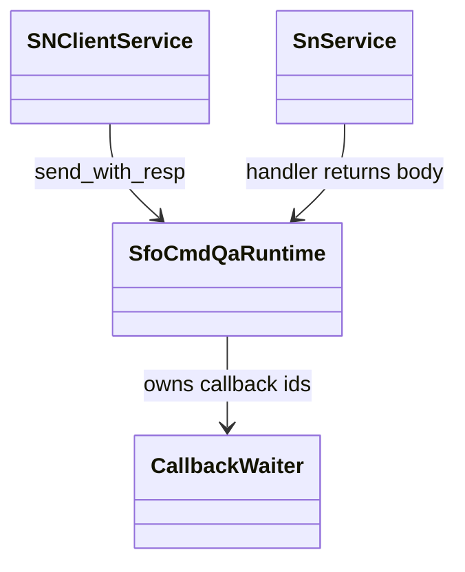
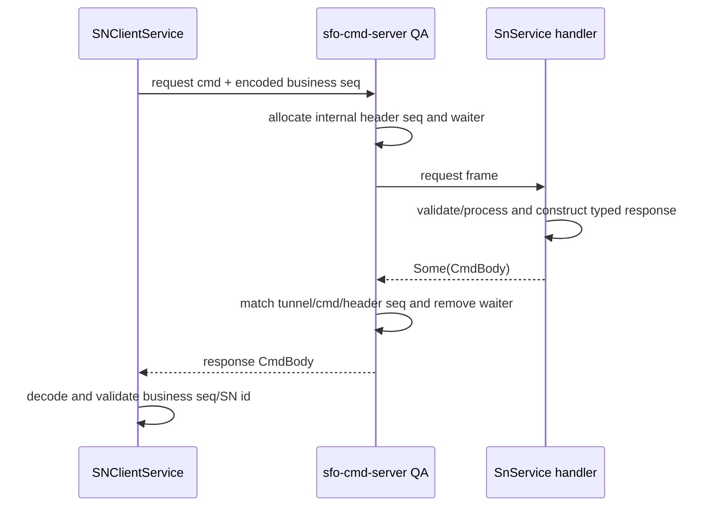
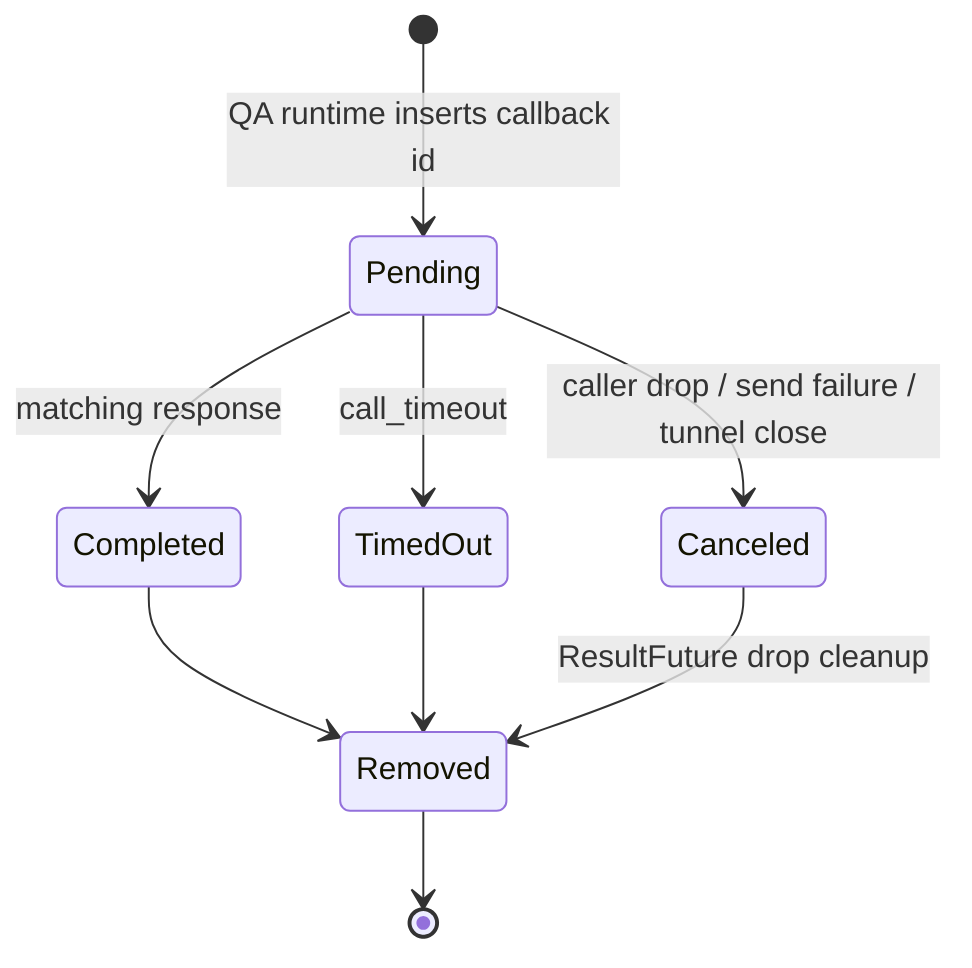

# SN Client QA Correlation Fix Design

## Design Scope
### Goals
- Migrate client-initiated `ReportSn`, `SnCall`, and `SnQuery` request/response pairs to the existing `sfo-cmd-server` QA mechanism.
- Remove SN-owned report/call/query response waiters and standalone response completion handlers.
- Keep QA tunnel/cmd/header sequence correlation fully inside `sfo-cmd-server`; SN code validates only business response fields.
- Make callback waiter cleanup cancellation-safe so a send failure or dropped QA future cannot leave an unbounded callback-id tombstone.
- Preserve `SnCalled` / `SnCalledResp`, body codecs, endpoint classification, call/query result meaning, and QUIC/TCP fallback behavior.

### Non-goals
- No QA migration for `SnCalled`, inter-SN, owner-directory, PN, or generic tunnel commands.
- No new SN application pending map, QA sequence API, capability negotiation, mixed-version fallback, or duplicate request send.
- No change to `PackageCmdCode`, Report/Call/Query body types, raw codecs, public `SNClientService` method signatures, or SN identity/TLS rules.

## Overall Approach
The client continues to generate the existing business `Sequence` inside each request body. Instead of sending a one-way request and installing an SN-owned `Notify`, it calls `send_by_specify_tunnel_with_resp(...)` with the request command. The command runtime creates and owns the QA header sequence, keys the pending response internally, and returns the response `CmdBody` to the same caller. SN code neither reads nor stores that header sequence.

Each SN service request handler decodes the request, calls an existing responsibility-specific handler that now returns the response value, encodes the value, and returns `Ok(Some(CmdBody))`. `sfo-cmd-server` writes the QA response using the same request command and header sequence. Handler errors continue to produce no successful body; the QA caller receives timeout/transport failure rather than a fabricated SN success response.

After decoding, the client verifies business identity independently of QA transport correlation:

- report: response `seq` equals request `seq`, and response `sn_peer_id` equals the target active/candidate SN;
- call: response `seq` equals request `seq`, and response `sn_peer_id` equals the active SN used for the call;
- query: response `seq` equals request `seq`; the authenticated command tunnel already binds the serving SN and `SnQueryResp` has no `sn_peer_id` field.

The current released and upstream `callback-result 0.2.4` removes callback entries only from inside the waiter future. If `sfo-cmd-server` creates the future and its send fails before that future is polled, dropping the future cancels its inner waiter but leaves the map entry. The workspace therefore patches crates.io `callback-result` to a local API-compatible copy. `ResultFuture` gains a private drop cleanup callback; `CallbackWaiter` installs cleanup when it inserts a callback id, the normal ready path removes the id and disarms the drop callback, and cancellation/drop removes the id synchronously before the inner notify is dropped. SN code remains unaware of callback ids.

## Simplicity Check
- Smallest sufficient approach: use the already-consumed QA API directly in three client methods and three existing service handlers; remove both SN waiter mechanisms rather than introduce a third abstraction.
- Existing components or patterns reused: `ClassifiedCmdSend::send_by_specify_tunnel_with_resp`, `CmdHandler -> Option<CmdBody>`, existing raw codecs, existing request body `Sequence`, existing command tunnel authentication, and existing `call_timeout`.
- New abstractions introduced: no new p2p-frame abstraction; one private drop-cleanup field/constructor in the vendored `callback-result::ResultFuture` implementation.
- Why each new abstraction is necessary: the private cleanup hook is required because the current dependency cannot remove an inserted callback id when its future is dropped before first poll; an SN-side workaround cannot access the private callback id and would duplicate QA state.

## Current Structure
- `SNServiceState.cur_report_future` is one global `Notify<ReportSnResp>` for every report attempt.
- `ActiveSN.recv_future` is a per-active-SN `HashMap<Sequence, Notify<SnResp>>` shared by Call and Query.
- `sn/client/mod.rs` publicly re-exports `SNServiceState`, `ActiveSN`, and `SnResp`; although no workspace caller consumes the waiter fields or enum, deleting them is a breaking Rust source API change for possible out-of-tree users.
- The client registers standalone handlers for `ReportSnResp`, `SnCallResp`, and `SnQueryResp`; those handlers locate and notify SN-owned waiters.
- `report`, `call`, and `query` send one-way request commands and wait outside `sfo-cmd-server` QA.
- The service handlers call `handle_report_sn`, `handle_call`, or `handle_query_sn`; those methods send standalone response commands and return `P2pResult<()>`.
- `sfo-cmd-server` already supports QA response headers, but its `CallbackWaiter` dependency is not cancellation-safe before first poll.

## Invariants to Preserve
- `SNClientService::report`, `call`, and `query` externally observable success/error result types and public method signatures remain unchanged.
- `ReportSn`, `ReportSnResp`, `SnCall`, `SnCallResp`, `SnQuery`, and `SnQueryResp` body fields and raw codec bytes remain unchanged.
- Report success still supplies the endpoint list used for the corresponding SN candidate only; QUIC-first/TCP-fallback and active-SN de-duplication remain unchanged.
- `SnCallResp` still means SN acceptance/result and may be returned after the SN has emitted `SnCalled`; it is not the `SnCalledResp` from the remote peer.
- `SnCalled` remains a server-initiated asynchronous command sent over all applicable tunnels, and `SnCalledResp` remains a standalone asynchronous response command.
- Connection validation, authenticated peer identity, endpoint classification/filtering, distributed query/call routing, and command control-stream-only transport remain unchanged.
- No legacy standalone Report/Call/Query response handler competes with QA completion after migration.

## Submodules
| Submodule | Type | Responsibility | Depends On | Exported Interface | Notes |
|-----------|------|----------------|------------|--------------------|-------|
| `sn_client` | business | Build Report/Call/Query requests, await QA bodies, validate business identity, and apply existing fallback/result behavior | `sn_service` wire contract, `cmd_qa_runtime` | Existing `SNClientService` methods | Owns no QA callback id or header sequence. |
| `sn_service` | business | Validate and process Report/Call/Query, produce typed response values, and preserve SnCalled async delivery | existing peer/directory/inter-SN services, `cmd_qa_runtime` | Existing command service handlers | Does not depend on `sn_client`. |
| `cmd_qa_runtime` | technical | Correlate QA frames and clean callback waiter state on ready, timeout, send failure, or cancellation | vendored `callback-result`, existing control stream | Existing `sfo-cmd-server` QA API | External crate boundary patched without public API change. |

## Boundary Rationale
| Boundary | Classification | Why Separate | Shared Logic / Technical Area | Notes |
|----------|----------------|--------------|-------------------------------|-------|
| `sn_client` | business | Owns client request choice, body validation, fallback, and returned results | consumes QA API only | Existing file remains the implementation location. |
| `sn_service` | business | Owns server validation, peer mutation, directory lookup, call relay, and response construction | consumes QA handler response contract | Existing file remains the implementation location. |
| `cmd_qa_runtime` | technical | QA header identity and callback lifecycle are transport infrastructure, not SN business state | callback-id allocation, lookup, timeout, and drop cleanup | Local patch is required because released/upstream cleanup is incomplete. |

## Boundary Decision Matrix
| boundary | classification | business_responsibility | shared_logic_or_technical_area | decision |
|----------|----------------|-------------------------|--------------------------------|----------|
| SN request client/service split | business | Client selects SN and validates returned business identity; service validates requester and constructs response | none; each side has one distinct role | keep existing split; change only response handoff. |
| QA correlation | technical | not-applicable: transport-owned correlation has no SN business responsibility | tunnel/cmd/header sequence and callback waiter lifecycle | keep entirely in `sfo-cmd-server`/`callback-result`; prohibit SN-side duplicate map. |
| Report/Call/Query shared helper | business | Three existing methods have different request construction, body validation, and result handling | only the QA call shape is similar and does not form an independently owned technical area | keep direct method implementations; a new generic SN QA abstraction would be single-file indirection with no separate owner. |
| SnCalled flow | business | Server-initiated remote peer notification and asynchronous acknowledgement | not a direct response to the caller's QA frame | retain standalone flow; do not merge into client QA migration. |

## Dependency Graph
| Source | Depends On | Reason | Cycle Check |
|--------|------------|--------|-------------|
| `sn_client` | `cmd_qa_runtime` | send request and await correlated response body | acyclic |
| `sn_service` | `cmd_qa_runtime` | return response body through handler QA frame | acyclic |
| `sn_service` | existing peer/directory/inter-SN services | preserve current Report/Call/Query business work | acyclic |
| `cmd_qa_runtime` | `callback-result` | own pending callback lifecycle | acyclic |



## Key Call Flows
| Flow | Caller | Callee / Submodule Path | Purpose | Failure Handling | Notes |
|------|--------|--------------------------|---------|------------------|-------|
| Report QA | ping/report loop | `SNClientService::report` -> command QA -> `SnService::handle_report_sn` | update peer state and return observed endpoints | Encode/send/QA timeout/body decode/body mismatch returns report error; existing candidate loop performs fallback. Service mutation completed before a response-write failure remains as today and is idempotent add/update. | Late standalone response has no registered handler and cannot complete a new QA request. |
| Call QA | caller API | `SNClientService::call` -> command QA -> `SnService::handle_call` | ask an active SN to accept/route a call | Per-active-SN failure continues to the next active SN; non-timeout transport failure may remove the failed connection as existing code does. Body mismatch is protocol failure and never returns the response. | Existing `SnCalled` emission occurs inside service processing before QA response construction. |
| Query QA | caller API | `SNClientService::query` -> command QA -> `SnService::handle_query_sn` | query local/distributed peer detail | Per-active-SN send/timeout/decode/mismatch failure continues to the next SN; empty successful result remains a valid `SnQueryResp`. | Query response has no SN-id field, so only business seq is checked. |
| QA cancellation cleanup | task cancellation or send failure | `sfo-cmd-server` -> vendored `CallbackWaiter::ResultFuture::drop` | remove an inserted callback id even before first poll | Drop cleanup locks waiter state and removes exactly the current id; normal Ready removes then disarms cleanup to avoid removing a later reused id. Poisoning follows existing mutex panic behavior. | No SN code participates. |



## Large Module Submodule Decision
| Submodule | Source Proposal | Decision | Design Packet | Reason |
|-----------|-----------------|----------|---------------|--------|
| `sn-client-qa-correlation-fix` | P-SN-CLIENT-QA-1 through P-SN-CLIENT-QA-3 | sibling fix packet over existing `sn/client`, `sn/service`, and command runtime boundaries | `sn-client-qa-correlation-fix/design.md` | The task creates no new production submodule; the packet isolates a correction to an approved Tier-0 module and its dependency patch. |

## Trigger Matrix
| trigger_category | applies | evidence | design_coverage | required_checks | deferred_checks_and_reason |
|------------------|---------|----------|-----------------|-----------------|----------------------------|
| contract/protocol | yes | Three standalone response commands become QA response frames while body codecs remain | Overall Approach, Key Call Flows, Interfaces, migration matrix below | new/new Report/Call/Query success; mismatched body rejection; confirm body codec and SnCalled command unchanged; mixed-version matrix | none |
| data/schema | no | No persisted state or body/raw codec field changes | Invariants to Preserve | source/codec diff review | none |
| security/privacy/permission | yes | Report/Call response SN identity and request business seq are trust-relevant | Overall Approach and Key Call Flows | reject wrong `sn_peer_id` and wrong business seq without state/result pollution | none |
| runtime/integration | yes | Timeout, cancellation, send failure, per-tunnel serialization, late responses, fallback, and callback state lifetime change | Key Call Flows and Data and State | report red-green; all failure transitions; concurrent calls remain bounded by existing per-tunnel send guard; fallback and SnCalled integration | none |
| build/dependency/config/deployment | yes | Root crates.io patch and lockfile bind a local `callback-result 0.2.4` copy; coordinated endpoints required | External Dependencies and Risks | patched crate build; lock/source review; clean relevant crate check; rollback path | none |
| ui/datamodel/workflow | no | No UI or presentation surface exists | Design Scope | confirm no UI paths changed | none |
| harness/process | no | Existing pipeline/admission/testing rules are consumed but not changed | Direct Mapping and Implementation Order | existing schema/admission/scope/testing/acceptance checks | none |

## Directly Mapped Change Items
| change_id | proposal_id | Design Coverage | Scope Paths | Interface / Boundary Impact | Notes |
|-----------|-------------|-----------------|-------------|-----------------------------|-------|
| sn_client_qa_transactions | P-SN-CLIENT-QA-1 | Overall Approach; Report/Call/Query Key Call Flows; body validation; SnCalled invariant | `p2p-frame/src/sn/client/sn_service.rs`, `p2p-frame/src/sn/service/service.rs` | migration-required command framing; public methods/body codecs unchanged; exported waiter state API removed | Coordinated client/server deployment and source migration required. |
| sn_client_qa_pending_cleanup | P-SN-CLIENT-QA-2 | Remove SN waiter state/handlers; callback future drop guard and lifecycle | `p2p-frame/src/sn/client/sn_service.rs`, `Cargo.toml`, `Cargo.lock`, `third-party/callback-result/**` | backward-compatible callback-result API behavior fix; removes private SN state | Local patch version remains 0.2.4. |
| sn_client_qa_migration_boundary | P-SN-CLIENT-QA-3 | Mixed-version matrix, no legacy fallback, unchanged body codecs and SnCalled flow | `p2p-frame/src/sn/client/sn_service.rs`, `p2p-frame/src/sn/service/service.rs` | migration-required Report/Call/Query command framing | No capability negotiation. |

## Implementation Order
| Phase | Goal | Preconditions | Outputs | Depends On | Parallel |
|-------|------|---------------|---------|------------|----------|
| 1 | Vendor and patch callback-result cancellation cleanup; bind root crates.io patch | approved design and implementation admission | local dependency source, root patch, refreshed lockfile | none | no |
| 2 | Make SnService Report/Call/Query handlers return typed QA response bodies | phase 1 compiles | service handlers use `Ok(Some(CmdBody))`; private business handlers return response types | 1 | no |
| 3 | Migrate SNClientService methods to QA and remove application waiter state/handlers | service framing available | direct QA awaits and body validation; deleted `cur_report_future`, `recv_future`, `SnResp`, response handlers | 2 | no |
| 4 | Run implementation-scope and compile checks, then hand delivered code to testing stage | all admitted code complete | scoped implementation evidence and compilable p2p-frame | 3 | no |

## Key Decisions
| Decision | Chosen | Alternatives Considered | Rejection Reason |
|----------|--------|-------------------------|------------------|
| Response correlation owner | existing command QA runtime only | SN map keyed by tunnel/body seq/SN id | Duplicates transport correlation and retains application cleanup complexity the user explicitly removed. |
| Dependency cleanup | local API-compatible callback-result patch with drop cleanup | accept canceled tombstones; patch only SN; upgrade to latest published versions | Tombstones are unbounded; SN cannot access private callback ids; latest callback-result/upstream and sfo-cmd-server 0.3.4 retain the defect. |
| Body validation | keep request business seq and applicable SN-id checks | trust QA header alone; expose QA header seq to SN | QA authenticates transaction routing, not response body correctness; exposing header seq violates the selected ownership boundary. |
| SnCalled | retain async standalone command | migrate SnCalled/Resp with Call QA | SnCalled is a server-initiated fan-out workflow and not the direct response to the caller's command. |
| Mixed versions | coordinated upgrade, no fallback | dual response handlers, duplicate send, capability negotiation | Dual paths reintroduce races; duplicate send needs idempotency; negotiation was not approved. |
| Per-tunnel QA concurrency | accept existing `sfo-cmd-server` send-guard serialization | patch sfo-cmd-server to release the guard before awaiting | SN commands are documented low-frequency control messages; changing generic guard concurrency would broaden dependency scope. Each held QA operation is bounded by `call_timeout`; testing must confirm progress after timeout/cancellation. |

## Data and State
| Data or State | Owner Submodule | Access For Others | State Transitions |
|---------------|-----------------|-------------------|-------------------|
| QA callback id/header seq | `cmd_qa_runtime` | opaque; SN receives only final `CmdBody` or error | absent -> inserted before write -> fulfilled and removed / timed out and removed / future dropped and removed; late response after removal -> `NoWaiter`. |
| Report/Call/Query business `Sequence` | initiating `SNClientService` stack frame | copied into request; service echoes; client compares after decode | generated -> encoded -> response match accepted / mismatch rejected; no shared registry. |
| active SN entry | `sn_client` | existing read APIs | report QA success with matching body -> inserted/refreshed; report failure/mismatch -> unchanged; transport failure may remove existing connection by current rules. |
| peer/directory state | existing `sn_service` managers | existing service interfaces | same mutations and failure behavior as before; QA changes only response delivery. |



## Testability
- Isolation seams per submodule: private response-validation helpers or direct method seams in `sn/client`; existing handler closures and business handler return values in `sn/service`; in-crate private-state tests in vendored `callback-result`.
- Replaceable external boundaries: existing fake/in-memory command tunnels and `CmdHandler`/`CmdBody`; no real external SN deployment is required for branch-level tests.
- How error/boundary cases will be triggered: delayed A response after timeout and B start, wrong business seq, wrong SN id, duplicate response, send writer failure, dropped QA future, command tunnel close, per-tunnel queued second request, empty query result, call that emits SnCalled before returning acceptance.
- Untriggerable failure paths and their alternative verification: true old/new deployed-process interoperability may be represented by command framing tests and explicit unsupported matrix if spawning old binaries is impractical; acceptance must not claim compatibility.

## Interfaces and Dependencies
### Exported interfaces
| Interface | Consumer | Compatibility | Notes |
|-----------|----------|---------------|-------|
| `SNClientService::call(...) -> P2pResult<SnCallResp>` | tunnel manager and existing p2p-frame callers | migration-required | Rust signature/result body unchanged, but both SN endpoints must migrate together to QA framing. |
| `SNClientService::query(...) -> P2pResult<SnQueryResp>` | existing p2p-frame/downstream callers | migration-required | Rust signature/result body unchanged; command framing requires coordinated endpoints. |
| SN report loop behavior | `sn_client_protocol_priority` and active-SN consumers | migration-required | No public method added; endpoint/fallback behavior unchanged after validated QA success, but command framing changes. |
| `callback_result::ResultFuture` public type and constructors | `sfo-cmd-server`, p2p-frame direct users | backward-compatible | Existing signatures and output remain; dropping an inserted waiter now removes its callback id. |
| `PackageCmdCode` and Report/Call/Query body types | new/old protocol code | backward-compatible | Type and codec surface stays stable; standalone response enum variants remain defined but new client/service do not register or emit them. |
| `ActiveSN.recv_future` public field | possible out-of-tree `p2p-frame::sn::client::ActiveSN` consumers; no workspace consumers found by source search | breaking | Field is removed with no replacement; callers must use `SNClientService::call/query` results and must not inspect internal response waiter state. |
| `SNServiceState.cur_report_future` public field | possible out-of-tree `p2p-frame::sn::client::SNServiceState` consumers; no workspace consumers found by source search | breaking | Field is removed with no replacement; report completion becomes internal QA state and is not externally inspectable. |
| `SnResp` public enum | possible out-of-tree imports; no workspace consumers found by source search | breaking | Enum is removed because it only tagged the deleted application waiter; callers consume the existing typed public method results instead. |

### File-level interfaces
```rust
// p2p-frame/src/sn/client/sn_service.rs: public signatures stay unchanged.
pub async fn call(
    &self,
    tunnel_id: TunnelId,
    reverse_endpoints: Option<&[Endpoint]>,
    remote: &P2pId,
    call_type: TunnelType,
    payload_pkg: Vec<u8>,
) -> P2pResult<SnCallResp>;

pub async fn query(&self, device_id: &P2pId) -> P2pResult<SnQueryResp>;

async fn report(&self, tunnel_id: CmdTunnelId, sn_peer_id: P2pId)
    -> P2pResult<ReportSnResp>;

// p2p-frame/src/sn/service/service.rs: private handlers return values instead of sending.
async fn handle_report_sn(/* existing identity/request inputs */)
    -> P2pResult<ReportSnResp>;
async fn handle_call(/* existing identity/request inputs */)
    -> P2pResult<SnCallResp>;
async fn handle_query_sn(/* existing identity/request inputs */)
    -> P2pResult<SnQueryResp>;
```

### External module dependencies
- `sfo-cmd-server = 0.3.3` remains the QA framing/runtime API provider.
- crates.io `callback-result = 0.2.4` is overridden through root `[patch.crates-io]` by `third-party/callback-result` with the same package name/version and API-compatible cleanup fix.
- `notify-future` and Tokio behavior remain inherited by the vendored crate; no new runtime dependency is added.

### External service or protocol constraints
- New clients and SN services must be deployed as a coordinated version for Report/Call/Query.
- Old/new and new/old combinations are unsupported and must fail without accepting a mismatched response or falling back to standalone handlers.
- `SnCalled` interoperability remains on the existing standalone command path.

## Migration Matrix
| Client | SN Service | Report/Call/Query | State Safety |
|--------|------------|------------------|--------------|
| new QA | new QA | supported | QA correlation plus body validation; no SN waiter state. |
| old standalone | old standalone | historical behavior, outside new acceptance | existing bug remains in old binaries. |
| new QA | old standalone | unsupported; QA wait times out or tunnel fails | standalone response has no registered completion path and cannot update new state. |
| old standalone | new QA | unsupported; old client does not consume QA response | new service does not emit a competing standalone response. |

## Document Index
| Document | Topic | Scope |
|----------|-------|-------|
| `proposal.md` | approved intent, scope, migration boundary, evidence | sibling task baseline |
| `design.md` | client/service QA flow, dependency cleanup, ownership, interfaces, scope paths, order | full task design |

## Risks and Rollback
- Per-tunnel `TrackedSendGuard` is held while a QA response is awaited, serializing same-tunnel commands. This is accepted for low-frequency SN control messages, but timeout/cancellation must release the guard and allow the next queued request to progress.
- The local callback-result patch affects every workspace consumer resolved to 0.2.4. Its API is unchanged, but cancellation timing changes intentionally; rollback removes the root patch and vendored directory together.
- Removing the publicly re-exported waiter fields and `SnResp` is a source-breaking cleanup approved by the proposal. Workspace search found no consumers; out-of-tree callers must migrate to the existing typed call/query APIs and cannot inspect QA pending state.
- If callback cleanup removes a replacement callback id, it can create a lost wakeup. The design prevents this by keeping current in-future removal before `Ready` and disarming drop cleanup on `Ready`; pending drop cleanup runs before the inner notify is dropped, so another live waiter cannot replace it first.
- If service handlers return a response before existing mutations/call delivery complete, behavior changes. Implementation must construct the response only at the current send point.
- If body validation fails, the client treats it as protocol failure and must not consume endpoints/call/query data; rollback must not restore standalone handlers without returning to proposal.
- Full rollback restores the previous client waiter fields/handlers and standalone service sends, removes the root dependency patch and vendored crate, and refreshes Cargo.lock as one atomic compatibility rollback.

## Design Guardrails
- Do not add SN-visible QA header sequence state or a replacement pending map.
- Do not delete response enum variants or body codec types merely because new code no longer emits standalone response commands.
- Do not migrate SnCalled/Resp or generic command runtime concurrency behavior.
- Keep all production logic out of `mod.rs`; this task changes responsibility-specific files only.
- Any implementation path beyond the mapped Scope Paths returns to design before editing.
- Post-implementation testing is generated only after the delivered implementation exists.

## Approval Record
- approver:
- approval_date:
- user_statement: ""
